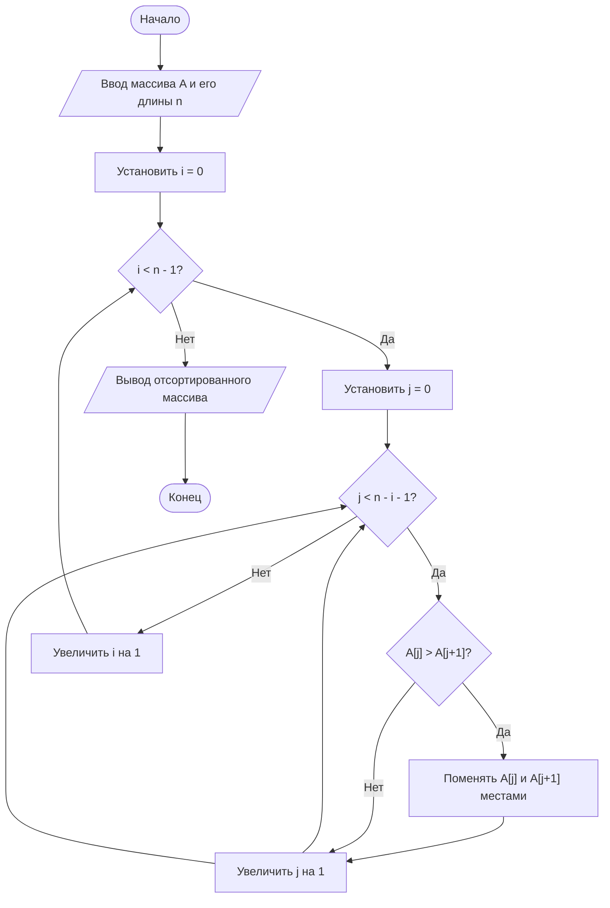

**МИНИСТЕРСТВО НАУКИ И ВЫСШЕГО ОБРАЗОВАНИЯ РОССИЙСКОЙ ФЕДЕРАЦИИ**

*Институт перспективной инженерии. Департамент цифровых, робототехнических систем и электроники. Межинститутская базовая кафедра*

**Лабараторная работа № 12**
**Тема:** "Введение в язык разметки Markdown"

**Дисциплина:** "Практическая деятельность"

**Выполнил:** 
Студент группы ПИЖ-б-о-25-2 (2),
направление подготовки: 09.03.04 «Программная инженерия»
Кравцун Михаил Алексеевич

**Проверил:** 
Ассистент межинститутской базовой кафедры ДЦРСиЭ 
Потапов Иван Романович

---
# Ссылка на репозиторий [**GitHub**](https://github.com/WhXteBeXr/Project-Activities/tree/main/lab13) задания

https://github.com/WhXteBeXr/Project-Activities/tree/main/lab13

---
# Алгоритм сортировки пузырьком (Bubble Sort)

## Описание
Алгоритм сортировки пузырьком — это простой метод сортировки массива. 
Он последовательно проходит по массиву, сравнивает соседние элементы 
и меняет их местами, если они стоят в неправильном порядке. 
Проходы повторяются до тех пор, пока массив не станет отсортированным.

---

## Блок-схема

---

# Контрольные вопросы

1. **Что такое Mermaid и для чего он используется?**  
    Mermaid — это текстовый язык разметки для создания диаграмм и блок-схем прямо из кода. Он используется для визуализации алгоритмов, процессов, архитектуры систем и других структур без графических редакторов.

2. **Как вставить диаграмму в Markdown-документ?**  
    Диаграмма вставляется с помощью блока кода с указанием языка `mermaid`:

В Obsidian или других редакторах с поддержкой Mermaid она автоматически отрисуется.

3. **Какие типы узлов (фигур) доступны в блок-схемах Mermaid?**  
    Основные типы:

- Овал — начало/конец: `([ ])`
- Прямоугольник — процесс: `[ ]`
- Ромб — условие: `{ }`
- Параллелограмм — ввод/вывод: `[/ /]` или `[\ \]`

4. **Чем отличаются стрелки `-->` и `-- текст -->`?**  
    `-->` — простое соединение без подписи.  
    `-- текст -->` — соединение с подписью, которая описывает условие или переход (например, «да» / «нет»).

5. **Как изменить ориентацию диаграммы с вертикальной на горизонтальную?**  
    Ориентация задаётся в первой строке диаграммы:

- `flowchart TD` — сверху вниз (вертикально)
- `flowchart LR` — слева направо (горизонтально)

6. **Зачем нужны подграфы (subgraph)?**  
    Подграфы используются для группировки узлов по блокам. Это помогает структурировать сложные диаграммы и визуально разделять этапы алгоритма.

7. **Какие символы нельзя использовать в идентификаторах узлов?**  
    В идентификаторах нельзя использовать пробелы и специальные символы (`[] { } () -->`).  
    Допускаются буквы, цифры и подчёркивание.

8. **Почему важно указывать начальный и конечный узлы?**  
    Они задают границы алгоритма. Начальный узел показывает старт выполнения, а конечный — завершение процесса. Без них схема считается неполной и хуже читается.
