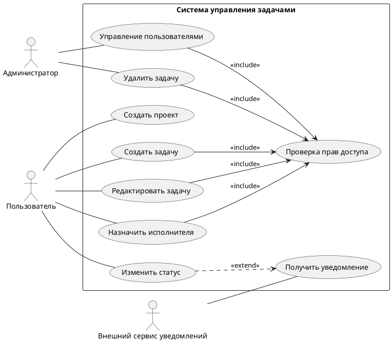

**МИНИСТЕРСТВО НАУКИ И ВЫСШЕГО ОБРАЗОВАНИЯ РОССИЙСКОЙ ФЕДЕРАЦИИ**

*Институт перспективной инженерии. Департамент цифровых, робототехнических систем и электроники. Межинститутская базовая кафедра*

**Лабараторная работа № 14**
**Тема:** "Диаграмма прецедентов (Use Case Diagram)"

**Дисциплина:** "Практическая деятельность"

**Выполнил:** 
Студент группы ПИЖ-б-о-25-2 (2),
направление подготовки: 09.03.04 «Программная инженерия»
Кравцун Михаил Алексеевич

**Проверил:** 
Ассистент межинститутской базовой кафедры ДЦРСиЭ 
Потапов Иван Романович

---
# Диаграмма прецедентов (Use Case Diagram)

## [GitHub репозиторий]()

---

## 1. Описание предметной области

В рамках лабораторной работы была выбрана предметная область **системы управления задачами** (аналог Trello-подобных сервисов). Данная система предназначена для организации работы пользователей над задачами и проектами.

**Основные функции системы:**
- создание и редактирование задач;
- назначение исполнителей;
- изменение статуса задач (например: «в работе», «выполнено»);
- объединение задач в проекты;
- управление пользователями (для администратора);
- отправка уведомлений о событиях в системе.

Система может использоваться как отдельными пользователями, так и командами для совместной работы.

---

### 2. Что такое PlantUML

**PlantUML** - это инструмент для создания UML-диаграмм с использованием текстового описания. Вместо графического редактора диаграмма задаётся с помощью специального синтаксиса, после чего автоматически генерируется её визуальное представление.

Преимущества PlantUML:
- быстрое создание диаграмм через код;
- удобство редактирования и поддержки;
- интеграция с редакторами (например, Obsidian);
- возможность хранения диаграмм в формате текста (Markdown).

В данной работе PlantUML используется для построения диаграммы прецедентов.

---

### 3. Описание диаграммы прецедентов

Диаграмма прецедентов отражает взаимодействие пользователей (акторов) с системой и показывает доступный функционал.

#### Акторы:
- **Пользователь** - основной участник системы, создаёт и управляет задачами.
- **Администратор** - управляет пользователями и имеет расширенные права.
- **Внешний сервис уведомлений** - внешняя система, отвечающая за отправку уведомлений.

#### Прецеденты:
- Создать задачу
- Редактировать задачу
- Удалить задачу
- Назначить исполнителя
- Изменить статус
- Создать проект
- Получить уведомление
- Управление пользователями
- Проверка прав доступа

Названия акторов заданы существительными, а прецеденты - глагольными формами, что соответствует требованиям UML.

---

### 4. Связи на диаграмме

В диаграмме использованы следующие типы связей:

**Ассоциации**  
Показывают, какие акторы взаимодействуют с какими прецедентами. Каждый актор связан хотя бы с одним прецедентом.

**Отношение `<<include>>`**  
Используется для вынесения общего поведения.  
В данной работе прецедент **«Проверка прав доступа»** включается в другие прецеденты, такие как:

- создание задачи;
- редактирование;
- удаление;
- управление пользователями.

Это означает, что перед выполнением этих действий система всегда проверяет права пользователя.

**Отношение `<<extend>>`**  
Отражает расширяемое поведение.  
Прецедент **«Получить уведомление»** расширяет **«Изменить статус»**, так как уведомление отправляется только при определённых условиях (например, при изменении состояния задачи).

---

### Диаграма (Система управления задачами)



---

## Контрольные вопросы
### 1. Что такое диаграмма прецедентов и для чего она используется?

**Диаграмма прецедентов (Use Case Diagram)** - это тип UML-диаграммы, который отображает взаимодействие пользователей (акторов) с системой через набор сценариев (прецедентов).

Она используется для:
- определения функциональных требований к системе;
- визуализации возможностей системы;
- понимания ролей пользователей;
- упрощения общения между разработчиками и заказчиками.

---

### 2. Чем актор отличается от прецедента?

**Актор** - это внешний участник системы (человек или другая система), который взаимодействует с ней.  
Пример: пользователь, администратор, внешний сервис.

**Прецедент** - это действие или функция, которую выполняет система.  
Пример: создать задачу, удалить задачу, изменить статус.

Ключевое различие:
- актор - _кто_ взаимодействует;
- прецедент - _что делает система_.

---

### 3. Что обозначает системная граница?

Системная граница - это прямоугольник, внутри которого располагаются все прецеденты системы.

Она показывает:
- где заканчивается система;
- какие функции входят в систему;
- какие акторы находятся вне системы и взаимодействуют с ней.

---

### 4. В чём разница между отношениями include и extend?

**`<<include>>`**
- обозначает обязательное включение одного прецедента в другой;
- используется для выделения общего поведения;
- выполняется всегда.

Пример: проверка прав доступа перед выполнением действия.

**`<<extend>>`**
- обозначает дополнительное (необязательное) поведение;
- выполняется только при определённых условиях.

Пример: отправка уведомления при изменении статуса.

---

### 5. Почему Mermaid не подходит для построения полноценных use case диаграмм?

**Mermaid** имеет ограничения при работе с UML-диаграммами прецедентов:
- отсутствует полноценная поддержка use case диаграмм;
- нет встроенных механизмов для `include`, `extend`, generalization;
- ограниченные возможности оформления UML-элементов;
- диаграммы получаются менее стандартизированными.

Поэтому для таких задач чаще используют **PlantUML**, который полностью поддерживает UML.

---

### 6. Какой синтаксис PlantUML используется для определения актора и прецедента?

В PlantUML используются следующие конструкции:

```plantuml
actor "Пользователь" as User
usecase "Создать задачу" as UC1
```

- `actor` — объявление актора
- `usecase` — объявление прецедента

---

### 7. Как в PlantUML задать отношение include?

Отношение `include` задаётся с помощью стрелки и ключевого слова:

```plantuml
UC1 --> UC2 : <<include>>
```

Это означает, что прецедент `UC1` включает в себя выполнение `UC2`.

---

### 8. Какие правила именования акторов и прецедентов вы знаете?

**Акторы:**
- именуются существительными;
- отражают роль, а не конкретного человека;
- пишутся с заглавной буквы.

Пример: Пользователь, Администратор.

**Прецеденты:**
- именуются глаголами или глагольными фразами;
- описывают действие системы;
- формулируются кратко и понятно.

Пример: Создать задачу, Изменить статус, Удалить пользователя.