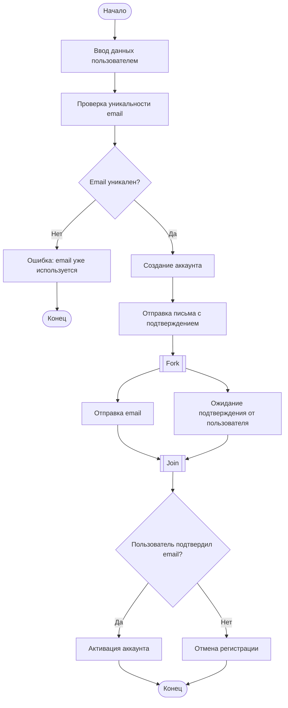
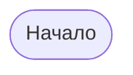
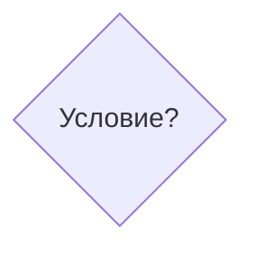
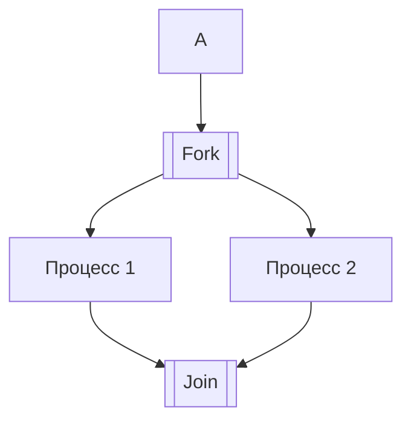

**МИНИСТЕРСТВО НАУКИ И ВЫСШЕГО ОБРАЗОВАНИЯ РОССИЙСКОЙ ФЕДЕРАЦИИ**

*Институт перспективной инженерии. Департамент цифровых, робототехнических систем и электроники. Межинститутская базовая кафедра*

**Лабараторная работа № 15**
**Тема:** "Диаграмма деятельности (Activity Diagram)"

**Дисциплина:** "Практическая деятельность"

**Выполнил:** 
Студент группы ПИЖ-б-о-25-2 (2),
направление подготовки: 09.03.04 «Программная инженерия»
Кравцун Михаил Алексеевич

**Проверил:** 
Ассистент межинститутской базовой кафедры ДЦРСиЭ 
Потапов Иван Романович

---
# Ссылка на репозиторий [GitHub](https://github.com/WhXteBeXr/Project-Activities/tree/main/lab15)

---
# Диаграмма деятельности: Регистрация пользователя на сайте

---
## Описание ключевых шагов

1. Пользователь вводит регистрационные данные (email, пароль и др.).
2. Система проверяет уникальность email.
3. Если email уже существует — регистрация прерывается с ошибкой.
4. Если email уникален — создаётся аккаунт.
5. Система отправляет письмо с подтверждением.
6. После подтверждения email аккаунт активируется.

---
## Пояснение к параллельным ветвям

После отправки письма процесс разделяется на два параллельных потока:
- отправка email системой;
- ожидание подтверждения от пользователя.

Оба процесса логически синхронизируются (Join), после чего система проверяет, подтвердил ли пользователь email.

---
## Используемые инструменты

- **Mermaid** — используется для построения диаграммы деятельности внутри Markdown.
- Поддерживается в GitHub и Obsidian (без дополнительных плагинов).

---
## Источники

- UML Activity Diagram — базовые принципы (учебные материалы)
- Документация Mermaid: [https://mermaid.js.org](https://mermaid.js.org)

---
# Контрольные вопросы

## 1. Что такое диаграмма деятельности и для чего она используется?

Диаграмма деятельности (Activity Diagram) - это тип UML-диаграммы, который описывает последовательность действий и поток управления в процессе.

Используется для:
- моделирования бизнес-процессов;
- описания алгоритмов;
- визуализации логики работы системы;
- анализа сценариев выполнения.

---
## 2. Чем диаграмма деятельности отличается от блок-схемы?

Основные отличия:
- диаграмма деятельности является частью UML и имеет строгую нотацию;
- поддерживает параллельные процессы (fork/join);
- учитывает роли и взаимодействие участников;
- используется для моделирования систем, а не только алгоритмов.

Блок-схема:
- проще;
- чаще применяется для описания алгоритмов;
- не имеет строгой UML-структуры.
    
---
## 3. Как обозначается начальный узел в Mermaid?

Начальный узел обозначается кругом:

---
## 4. Как обозначается узел решения (ветвление)?

Узел решения обозначается ромбом с условием:

Ветви подписываются, например:
- Да    
- Нет

---
## 5. Как в Mermaid реализовать параллельные ветви (fork/join)?

В Mermaid нет отдельного строгого элемента fork/join, как в UML, поэтому используется логическое разделение и объединение потоков.

Пример:

Здесь:
- `[[Fork]]` — точка разделения;
- `[[Join]]` — точка объединения.

---
## 6. Зачем нужны узлы слияния (merge) и соединители (join)?

**Merge (слияние)**:
- объединяет альтернативные ветви (например, после условия if/else);
- используется после узла решения. 

**Join (соединение)**:
- объединяет параллельные потоки;
- ожидает завершения всех ветвей.

Разница:
- merge — для логических альтернатив;    
- join — для параллельных процессов.

---
## 7. Какие правила именования действий вы знаете?

Действия:
- формулируются глаголами (или глагольными фразами);
- должны быть краткими и понятными;
- описывают конкретное действие системы или пользователя;
- пишутся с заглавной буквы.

Примеры:
- Ввести данные
- Проверить email
- Отправить сообщение

---
## 8. Можно ли на одной диаграмме деятельности иметь несколько конечных узлов?

Да, можно.

Это используется, когда:
- процесс имеет несколько вариантов завершения;
- существуют разные исходы (например, успех и ошибка).

Пример:
- успешная регистрация -> один конечный узел;
- ошибка -> другой конечный узел.