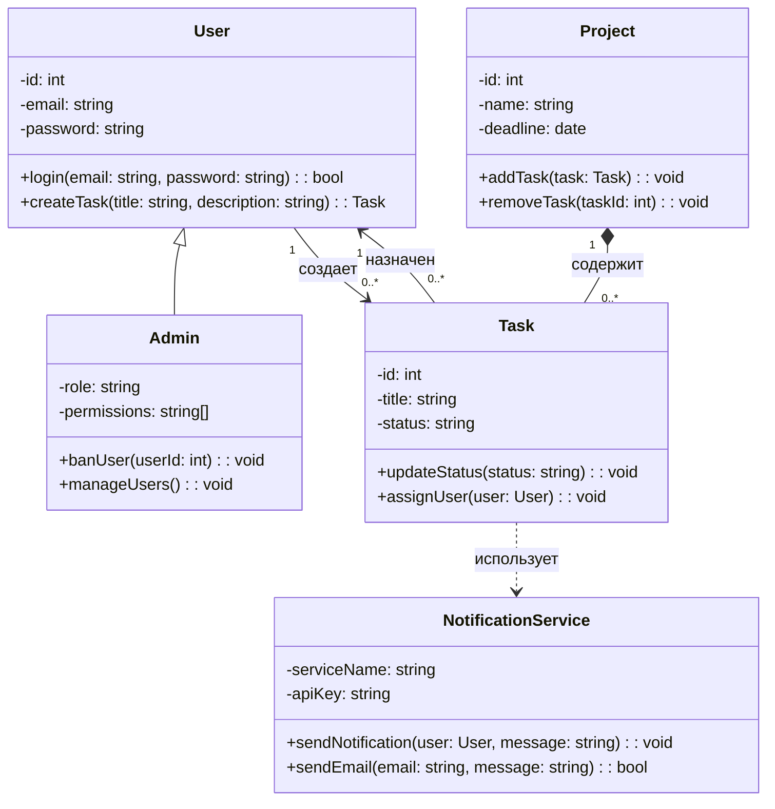
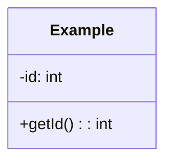
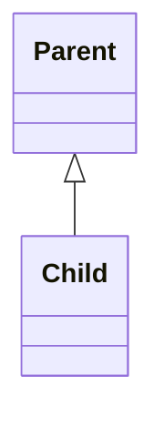
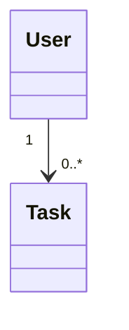
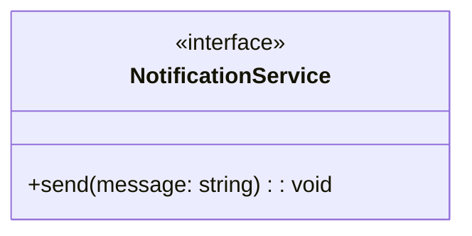
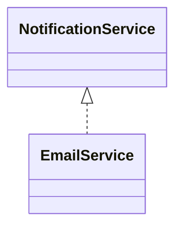
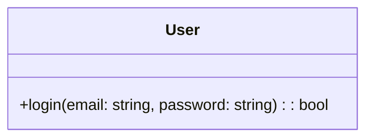

**МИНИСТЕРСТВО НАУКИ И ВЫСШЕГО ОБРАЗОВАНИЯ РОССИЙСКОЙ ФЕДЕРАЦИИ**

*Институт перспективной инженерии. Департамент цифровых, робототехнических систем и электроники. Межинститутская базовая кафедра*

**Лабараторная работа № 16**
**Тема:** "Диаграмма классов (Class Diagram)"

**Дисциплина:** "Практическая деятельность"

**Выполнил:** 
Студент группы ПИЖ-б-о-25-2 (2),
направление подготовки: 09.03.04 «Программная инженерия»
Кравцун Михаил Алексеевич

**Проверил:** 
Ассистент межинститутской базовой кафедры ДЦРСиЭ 
Потапов Иван Романович

---
# [GitHub](https://github.com/WhXteBeXr/Project-Activities/tree/main/lab16) репозиторий работы

---
# Диаграмма классов: Система управления задачами

---
## Описание диаграммы

Диаграмма классов отражает статическую структуру системы управления задачами. Она показывает основные сущности системы, их свойства (атрибуты), поведение (методы) и связи между ними.

---
## Классы

**User (Пользователь)**  
Представляет обычного пользователя системы. Может создавать задачи и входить в систему.

**Admin (Администратор)**  
Наследуется от пользователя и имеет дополнительные возможности управления системой.

**Task (Задача)**  
Основной элемент системы, содержащий информацию о задаче и её состоянии.

**Project (Проект)**  
Объединяет задачи в логические группы.

**NotificationService (Сервис уведомлений)**  
Отвечает за отправку уведомлений пользователям.

---
## Отношения между классами

### Наследование

- `Admin` наследуется от `User`  
    Это означает, что администратор обладает всеми свойствами пользователя и расширяет их.    

---
### Ассоциации

- Пользователь создаёт задачи (`1 → 0..*`)
- Задача назначается пользователю

Ассоциации показывают логическую связь между объектами.

---
### Композиция

- `Project` содержит `Task`

Композиция означает, что задачи не существуют вне проекта (жёсткая связь жизненного цикла).

---
### Зависимость

- `Task` использует `NotificationService`

Это временная связь: задача вызывает сервис уведомлений при необходимости.

---
## Используемые инструменты

- **Mermaid** - используется для построения диаграммы классов в Markdown.
- Поддерживается в Obsidian и GitHub.

---
# Контрольные вопросы

## 1. Что такое диаграмма классов и для чего она используется?

Диаграмма классов (Class Diagram) - это UML-диаграмма, описывающая статическую структуру системы: классы, их атрибуты, методы и связи между ними.

Используется для:
- проектирования архитектуры системы;
- описания структуры кода;
- анализа предметной области;
- документирования программных решений.

---
## 2. Какие три основные секции имеет прямоугольник класса?

Класс состоит из трёх частей:
1. **Имя класса**
2. **Атрибуты** (поля, свойства)
3. **Методы** (функции, поведение)

Пример:

---
## 3. Что означают символы `+`, `-`, `#` перед атрибутами и методами?

Это обозначения видимости:
- `+` - **public** (доступно всем)
- `-` - **private** (доступно только внутри класса)
- `#` - **protected** (доступно в классе и его наследниках)

---
## 4. Как в Mermaid обозначается наследование?

Наследование задаётся стрелкой с пустым треугольником:

Это означает, что `Child` наследуется от `Parent`.

---
## 5. В чём разница между агрегацией и композицией?

**Агрегация (`o--`)**:
- слабая связь;
- объекты могут существовать отдельно;
- пример: команда и игроки.

**Композиция (`*--`)**:
- сильная связь;
- часть не существует без целого;
- пример: проект и задачи.

---
## 6. Как указать множественность отношения (например, «один ко многим»)?

Множественность указывается в кавычках возле связи:

Это означает:
- один пользователь;
- много задач.

---
## 7. Как изобразить интерфейс в Mermaid?

Интерфейс задаётся с помощью `<<interface>>`:

Реализация интерфейса:

---
## 8. Какую информацию можно указать в сигнатуре метода?

В сигнатуре метода указывается:
- имя метода;    
- параметры (с типами);
- возвращаемый тип;
- (опционально) видимость.

Пример:

Здесь:
- `login` - имя метода;
- `email`, `password` - параметры;
- `bool` - возвращаемый тип.